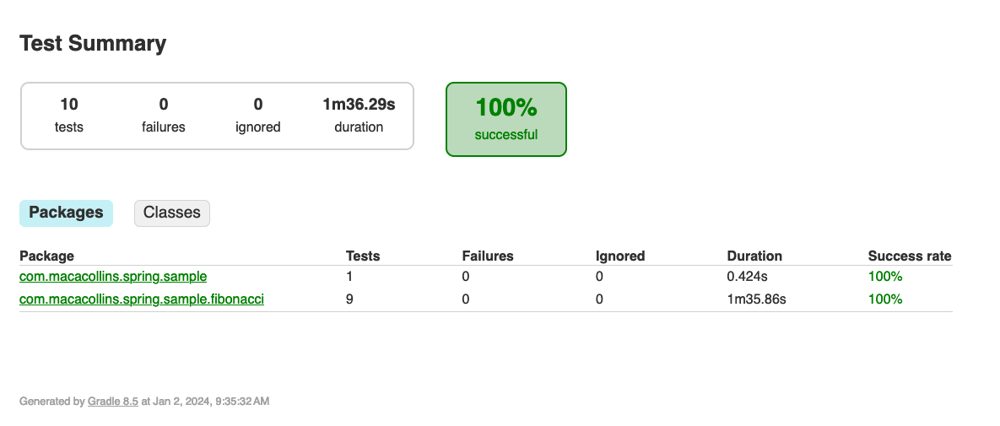

# Correctness

While performance is important, it's not useful without returning the correct results. This service includes unit tests to verify the correctness of the Fibonacci generators.

# Unit Tests



As this is a Spring Boot service, JUnit 5 was already included in the project. I wrote tests to check the results of the Fibonacci generators against the known Fibonacci sequence. There is a file `FibonacciNumbers.java` that contains the first 301 sequence elements.

The unit tests for this service are bundled in the Java service so that it can use the same package management and refer to code inside the project. The directory with most of the tests is [here](/java/src/test/java/com/macacollins/spring/sample/fibonacci).

Tests for the naive recursive algorithms can take quite a long time with sequence items above 48. For this reason, the tests for BigIntFibonacciGenerator do not test the full 300 sequence items. The memoized version and for loop version both complete 300 items very quickly so the full amount is included.

# Continuous integration

Normally, these tests would run as part of a CI pipeline. There is no pipeline set up for this project at the moment. However, you can run the unit tests by navigating to the java directory and running

```bash
./gradlew test
```

This will download the required dependencies, build the application, and run the unit tests.

# Next Steps

The next step in automated testing would be integration testing around the HTTP endpoint that verify error checking behavior. The other approach is to set up a test deployment and a CI job that runs HTTP requests against the server and verifies the behavior.

