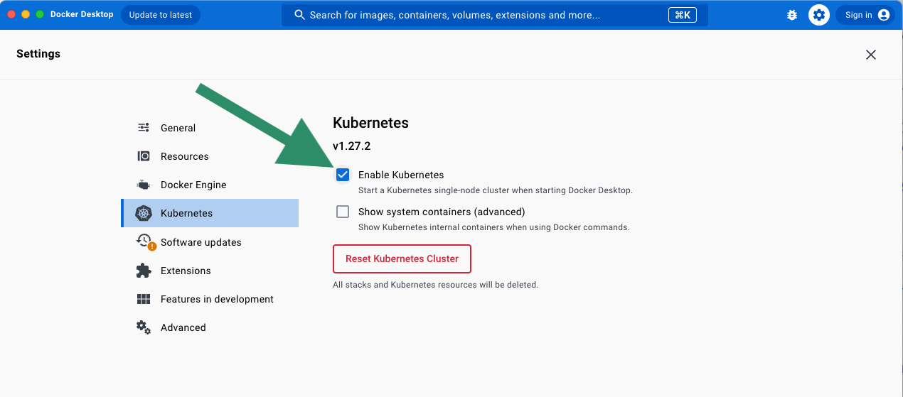
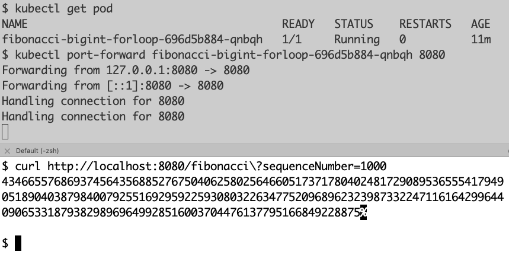

# Deployment

For a real application, the deployment phase would involve a CI/CD job to build and publish the image to a container repository. Also, the manifests in kubernetes-manifests directory would need to include some manifests for networking (Service, OpenShift Route, service mesh, etc.). Then, you could deploy the manifests in the kubernetes-manifests directory.

For this sample application, you can run it on Docker Desktop. 

# Setting up Docker Desktop

1. First, download Docker Desktop if you don't have it from [this link](https://www.docker.com/products/docker-desktop/) 
2. Run the Docker Desktop application
3. Enable Kubernetes



4. Ensure the `docker` and `kubectl` commands work. 
5. Run the following commands:

```bash
docker build . -t fibonacci-java-sample

kubectl apply -f kubernetes-manifests
```

6. This directory does not currently include any networking, but you can test with `kubectl port-forward`: 

```bash
kubectl get pod
kubectl port-forward <pod id> 8080
curl localhost:8080/fibonacci\?sequenceNumber=1000
```



