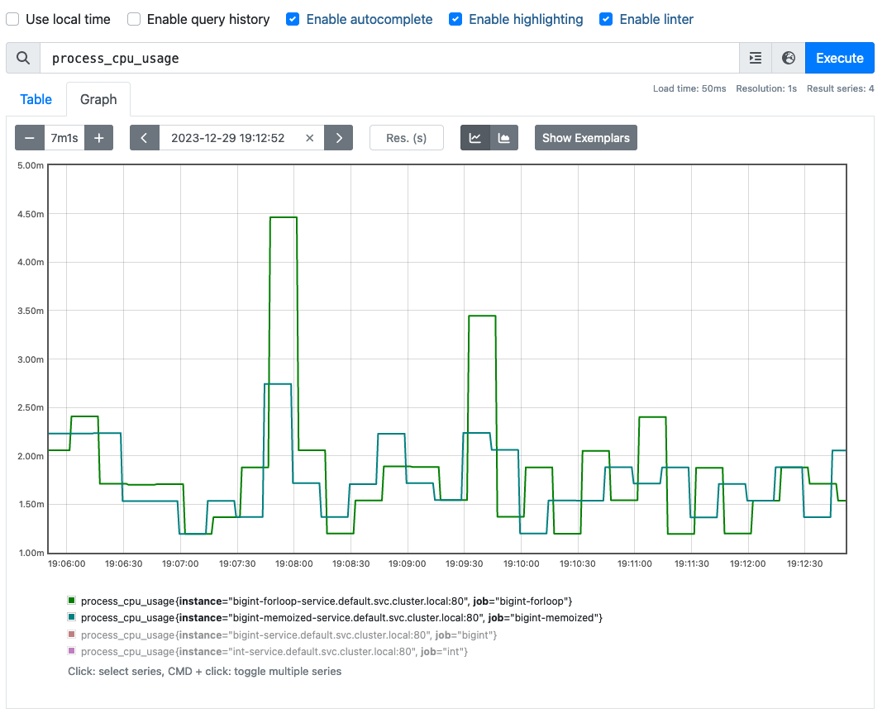

# Java/Spring Sample

This is a sample microservice using Java and Spring Boot. The application itself calculates Fibonacci values and uses one of three methods based on an environment variable. This functionality was chosen to show an evidence-based approach to making changes. The same methodology of deploying multiple versions of a service and checking logs and metrics is standard debugging practice for real-world services. First, let's cover the different methods used in the Java applications.

# Naive Algorithm

The Fibonacci algorithms used in this application all rely on recursion to calculate the appropriate values. For Fibonacci values themselves, you can check out [this link](https://www.math.net/list-of-fibonacci-numbers). The naive version with just integers is included in the IntegerFibonacciGenerator class:

```java
    public int getFibonacciInt(int sequenceNumber) {
        if (sequenceNumber == 0) {
            return 0;
        } else if (sequenceNumber == 1) {
            return 1;
        } else {
            return getFibonacciInt(sequenceNumber - 1) +
                    getFibonacciInt(sequenceNumber - 2);
        }
    }
```

This method appears to work at first, but there are a couple of drawbacks. The first is that `int` has limited precision. After the 48th value in the fibonacci sequence, this method will overflow and become negative. Switching to `long` extends the capability up to the 92nd number, but then this service is unnecessarily limited. Computers can quickly generate way more than 92 Fibonacci numbers.

# BigInteger

Java has the `BigInteger` class for numbers above the limits of `long`. So, the second version of this method uses the `BigInteger` class. The code is basically the same and found in the `BigIntFibonacciGenerator` class.

```java
    private BigInteger getFibonacciBigInt(int sequenceNumber) {
        if (sequenceNumber == 0) {
            return BigInteger.ZERO;
        } else if (sequenceNumber == 1) {
            return BigInteger.ONE;
        } else {
            return getFibonacciBigInt(sequenceNumber - 1).add(
                    getFibonacciBigInt(sequenceNumber - 2));
        }
    }
```

This method works great... for only a few more numbers than the `int` version. The second problem with the naive recursive algorithm is that it calculates the same values many many times. Around 50 items, this gets so slow that most REST clients and network devices (service mesh, ingress, etc.) will time out and the client will not get a successful response. Not good.

# Memoized BigInteger

The Fibonacci method is a "pure function", meaning that the same input will always produce the same output. This means we can memoize, or cache, the results in order to prevent the code from calculating intermediate results many many times. 

This code uses a `HashMap`, but an `Array`/`ArrayList` could also be used here with slightly different storage size and resizing characteristics. If that level of performance matters, you could repeat the method used in this service to test an implementation using `Array` instead.

```java
    private Map<Integer, BigInteger> memo = new HashMap<>();

    private BigInteger getFibonacciBigIntMemoized(int sequenceNumber) {
        // If the service already calculated the number, no need to do it again
        if (memo.containsKey(sequenceNumber)) {
            return memo.get(sequenceNumber);
        }

        BigInteger result;
        if (sequenceNumber == 0) {
            result = BigInteger.ZERO;
        } else if (sequenceNumber == 1) {
            result = BigInteger.ONE;
        } else {
            result = getFibonacciBigIntMemoized(sequenceNumber - 1).add(
                    getFibonacciBigIntMemoized(sequenceNumber - 2));
        }

        // Save the new computed result
        memo.put(sequenceNumber, result);

        return result;
    }
```

With this code in place, the service can handle quite a few more results. The limit is now in the recursion limit of the JRE, which the code does hit after a few thousand items in the sequence. You can increase the limit by requesting sequence number 500, then 1000, then 1500, etc. to populate the cache and reduce the size of the recursion stack. This example does not manually prime the cache from within the service, but such a thing is possible on startup. Without the recursion stack limitation, the limit becomes memory for cache results. The service should be able to fit many results in a few megabytes as they contain much less data than images, for example.

While testing a version of the traffic script that requesests sequence numbers 200 at a time (200, 400, 600, etc.), the recursion stack limit did not kick in even up to 10000 sequence items. Memoization and recursion works fine as long as you slowly increase the sequence numbers. This is admittedly an unacceptable limitation in the real world. 

# For Loops

To avoid the recursion stack limit, the fibonacci algorithm can be restructured as a for loop. With BigInteger, the code still handles very large numbers. Example code:

```java
    public static BigInteger getFibonacciForLoop(int sequenceNumber) {
        if (sequenceNumber == 0) {
            return BigInteger.ZERO;
        } else if (sequenceNumber == 1) {
            return BigInteger.ONE;
        } else {
            BigInteger oneBefore = BigInteger.ZERO;
            BigInteger twoBefore = BigInteger.ONE;
            BigInteger current = BigInteger.ZERO;

            for (int i = 2; i <= sequenceNumber; i++) {
                current = oneBefore.add(twoBefore);
                oneBefore = twoBefore;
                twoBefore = current;
            }

            return current;
        }
    }
```

This code handles arbitrary sequence numbers without a recursion limit. The limit now is the size of the BigInteger in memory, which can scale up by giving more memory to the service. As more requests come in, you can cache the results in various places between the clients and the server to cut down on load, due to the stateless nature of the service.

# Testing

This code and reasoning is interesting, but we need data to tell us whether the changes really matter. For this example, it's possible to know beforehand that `int` / `long` / `BigInteger` without cache is not going to work for large numbers. However, this project includes testing and metrics to ensure the services are working as expected. For any changes to a production service, we need to check the data to ensure that changes are going to make the desired change to the service at runtime.

This example uses some Kubernetes manifests in a Helm chart to allow testing the different versions. All four algorithms are included in the Java / Spring Boot server container image. The Java code uses an environment variable to switch between the different modes. The details are in the `FibonacciFactory` class. Each algorithm has its own Kubernetes Deployment and Service in the `helm-testing` directory. Then, a script simulates traffic to the different services. The script is deployed to Kubernetes as a deployment with a script manually mounted into the container from a Kubernetes ConfigMap. The details are in the `deployment-traffic.yaml` file. This script makes requests to each of the services every couple of seconds with an increasing sequence number.

# Metrics

The Java application is instrumented using the Micrometer project, which is the default for Spring Boot. This worked well out of the box and provided a metrics endpoint under the /actuator/prometheus path. The testing manifests include a deployment for a Prometheus server that scrapes the three deployments and records the metrics. Using `kubectl port-forward` allowed me to check the metrics and how they change over time. This minimal Prometheus setup is used because there is no corporate Kubernetes test cluster with an annotation-based Prometheus lookup. The full configuration details, including the custom prometheus.yml, are included in the `deployment-prometheus.yaml` file.

# Results


This graph shows the count of successful requests to the three different versions. The results show a steadily increasing number for the memoized `BigInteger` version. However, the numbers are quite messy for the `int` and non-memoized `BigInteger` versions. Many requests never completed, and the containers restarted often due to the strain of computing large Fibonacci values without memoization. The choice between recursive options is obvious--memoized `BigInteger` is the winning version according to the data.


This metric records a Prometheus `Summary` of the timing of fibonacci generation from the server's point of view. The non-memoized versions didn't even return values after a certain point as they started to fail. The memoized service returned a fairly performant profile with the 99.9th percentile at 9ms for the 500th sequence item. More testing is needed for higher sequence numbers, but the service is already set up to record metrics.

# For Loop vs. Memoized performance

While the for loop version does not suffer from stack size limits, we still need to measure performance against the memoized recursive version.

## Timing


This graph shows the performance of the memoized `BigInteger` recursive algorithm against the for-loop version of the code. The Prometheus metric resulting from the `@Timed` annotation is used here. Both the for loop and memoized recursive version have similarly performant 99.9 quantile performance at levels up to 10000 sequence items, returning results in under 1 millisecond. Further testing is needed to establish the limits of these services.

## Memory Usage

The memoized version of the graph trades memory for computation, let's check how much memory it uses. To do this, we will look only at the G1 Survivor space as the Eden space is filled by Spring Boot and collected regularly by the garbage collector. The `HashMap` that stores results, however, stays in the heap and does not get collected as there is a static reference to it in the Factory class.


This graph shows the JVM memory usage after quite a bit of usage for both versions of the service. After 10000 sequence items, the memoized version of the service stores about 830kb more data on the heap. This is not that much, but going to the 1,000,000,000th sequence item would require 830gb memory if storage increased linearly, and it doesn't. It would be much worse than that as each sequence item is considerably larger than the previous items. More testing is required to find a practical upper bound where each item becomes prohibitively expensive to store in memory. Another consideration is that this storage is listed per instance of the server, so a Kubernetes cluster running 100 of these will pay the storage cost 100 times.

This alone could also disqualify the memoized version of the service depending on requirements for upper bounds.

## CPU usage

The for loop version performs more calculations but stores less in memory than the memoized recursive version. Let's check the difference in CPU usage.



The Prometheus metric `process_cpu_usage` is used here. In this test, the CPU usage of running a JVM and Spring Boot is considerably larger than the cost of running Fibonacci calculations even at the 10,000th sequence item level. So, the graphs are very similar for the two versions. We need further testing using higher sequence numbers and more requests in order to determine the real differences in performance between the for-loop version and memoized recursive version.

# Conclusion

The for-loop version has similar performance to the memoized recursive version of the code at the 3 nines level after priming. Also, the for loop version does not have the potential to blow the recursion stack and return an error. For this reason, the for-loop version of the code should be preferred for the final version of the service.

# Next steps

There are several more things to do here.

- Finalize the Kubernetes items for the deployment target: Service, Ingress, Route (OpenShift), or other CRD (Service mesh or AWS / Azure / GCP items)
- Unit tests
- Grafana Dashboards to make metric data more digestible
- Edge case testing, this primarily measures the happy path
- For real production, remove the algorithms that aren't chosen
- Much higher sequence number testing on the for-loop algorithm
- Complete instructions for running the examples


